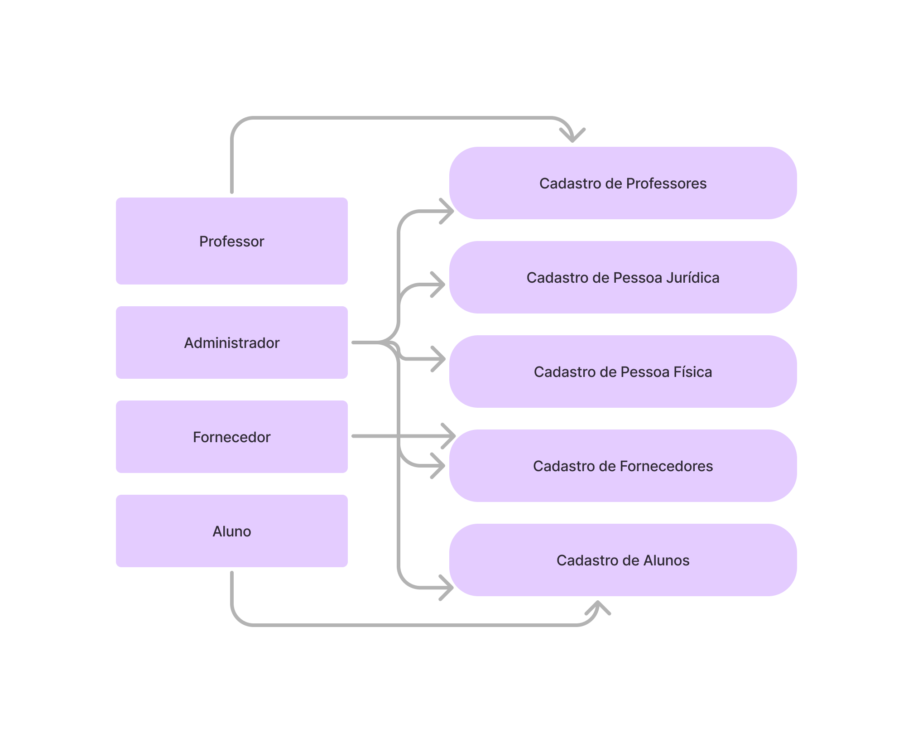
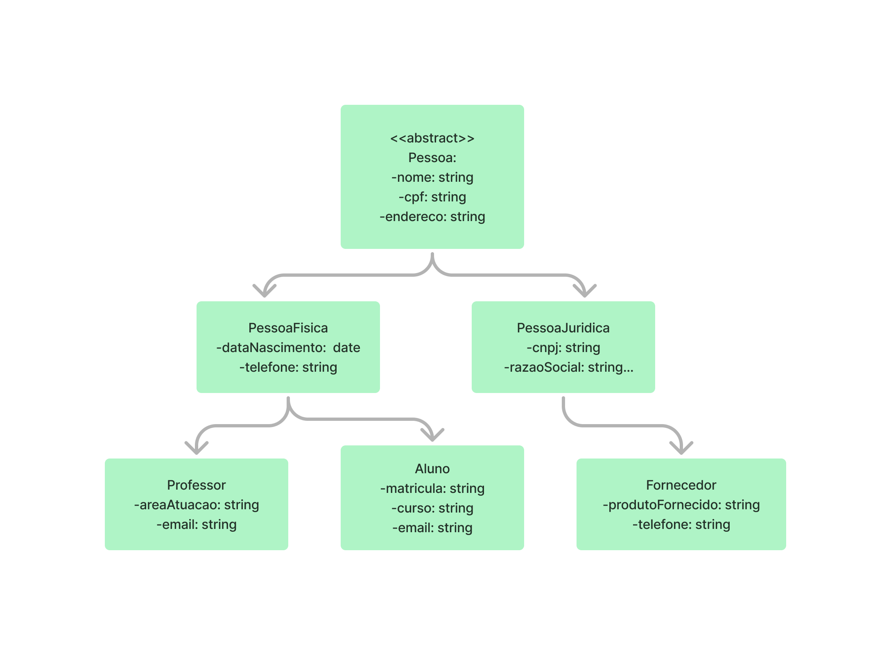
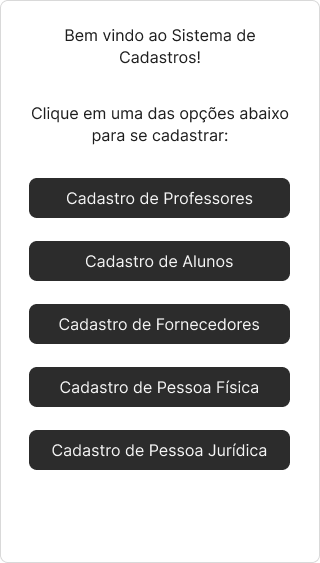
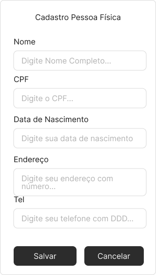
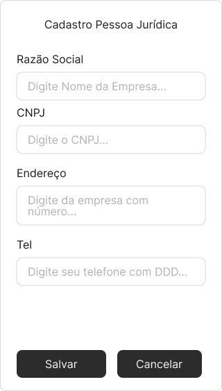
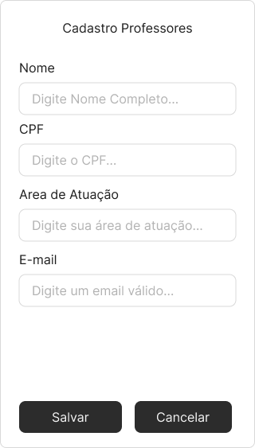
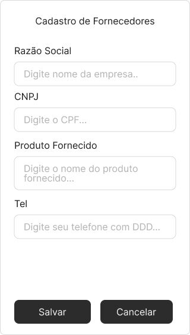
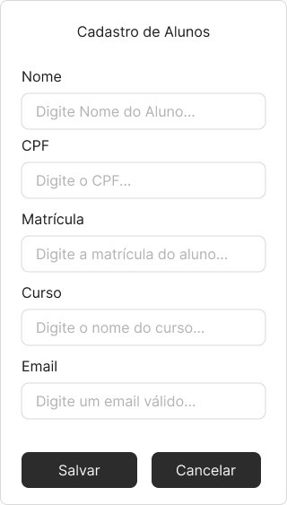

# Sistema de Gestão Universitária

Este projeto visa desenvolver um sistema orientado a objetos para a gestão de dados de uma grande universidade, abrangendo o cadastro de diferentes tipos de usuários e entidades relacionadas.

## Estrutura do Projeto

O projeto está organizado da seguinte forma:

- **/diagrams**: Contém os diagramas UML desenvolvidos na Fase 1 do projeto.
  - `use_case_diagram.png`: Diagrama de Caso de Uso.
  - `class_diagram.png`: Diagrama de Classes.

- **/prototypes**: Inclui os protótipos de interface criados na Fase 2.
  - `prototype.pdf`: Protótipos das interfaces de usuário.

- **/docs**: Documentação adicional do projeto.
  - `readme.md`: Este arquivo de documentação.

## Fase 1: Modelagem do Sistema

Na primeira fase, foram elaborados os seguintes diagramas utilizando a Linguagem Unificada de Modelagem (UML):

### Diagrama de Caso de Uso

Este diagrama representa os principais casos de uso do sistema, incluindo:

- Cadastro de Pessoa Física
- Cadastro de Pessoa Jurídica
- Cadastro de Professores
- Cadastro de Fornecedores
- Cadastro de Alunos

### Diagrama de Classes

O diagrama de classes detalha a estrutura do sistema, destacando as classes principais e seus relacionamentos, como herança e associações.

## Fase 2: Protótipos de Interface

Nesta fase, foram desenvolvidos protótipos das interfaces do sistema, refletindo os casos de uso modelados anteriormente. Os protótipos foram criados utilizando a ferramenta Figma e estão disponíveis no arquivo na pasta `/assets/telas`.

As interfaces contemplam as seguintes jornadas:

- Home

- Cadastro de Pessoa Física

- Cadastro de Pessoa Jurídica

- Cadastro de Professores

- Cadastro de Fornecedores

- Cadastro de Alunos

- Sucesso

Clique aqui para acessar o fluxo completo da operação:

(https://www.figma.com/proto/hrPA96YNW5olXQdZp95VZi/Projeto-Integrador-Senac?node-id=1-2334&node-type=canvas&t=q9hvgVNiu0wvI5tb-1&scaling=min-zoom&content-scaling=fixed&page-id=0%3A1&starting-point-node-id=1%3A2334)

## Repositório no GitHub

Todos os integrantes do grupo possuem contas no GitHub e foram adicionados como colaboradores neste repositório. A colaboração foi essencial para o desenvolvimento e versionamento do projeto.

## Observações

A parte opcional, que envolve o desenvolvimento das interfaces utilizando HTML, CSS e a conexão com o backend, não foi implementada nesta entrega.

Para mais detalhes sobre o projeto ou contribuições futuras, sinta-se à vontade para explorar as pastas e arquivos deste repositório. 